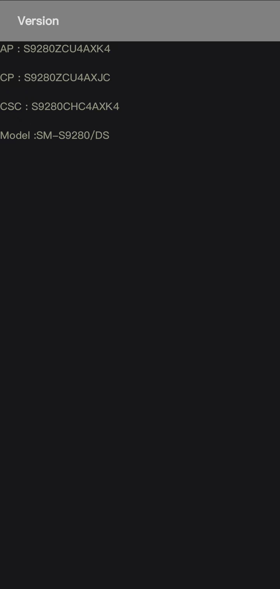
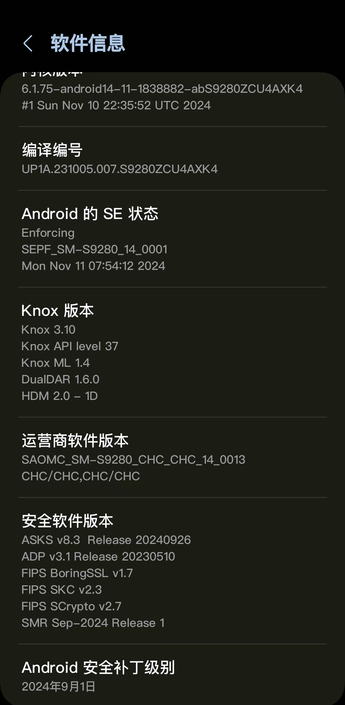

# 主要功能
通过生成序列号穷举MD5编码后的结果与官网对比，达到解码版本号的功能。
三星测试版固件官网:`https://fota-cloud-dn.ospserver.net/firmware/区域码/设备型号/version.test.xml`,示例网站：如[国行版S24 Ultra](https://fota-cloud-dn.ospserver.net/firmware/CHC/SM-S9280/version.test.xml)
# 如何添加自己需要的设备
`Fork`本项目或`git clone`代码到本地,修改`models.txt`，添加格式为`设备名称,设备型号,地区代码(多个地区用|分隔)`，将自己需要的设备型号添加进去；并将`三星测试版固件版本号解密.py`文件最下面的`getModelDictsFromDB`改为`getModelDicts`,重新运行脚本。

# 如何根据三星固件版本号获取相关信息？
以S24 Ultra这个型号的"S9280ZCU4BXKV/S9280CHC4BXKV/S9280ZCU4BXKV"为例，
首先以"/"为分隔符将版本号分为3个部分，分别表示`内部版本号`、`CSC版本号`、`基带版本号`(wifi版无基带版本号)
## 以内部版本号"S9280ZCU4BXKV"为例：
1. 第一部分：前4个字符(`S928`)表示手机型号:
    - `S`: 第一个字符表示所属系列，如"S"代表S系列，除此之外，还有F开头的(折叠屏设备)、A开头(A系列)、E开头的、以及曾经的N开头(Note系列)等，（PS:S21系列及以前用G开头，S22系列开始变成了"S"开头)；
    - `9`:第二个字符"9"代表高端系列，数字越小，代表越低端，如S23 FE版本就是S711；
    - `2`：第三个字符代表该系列代数(从**0**开始计)，S24 Ultra(S928)是2，S23 Ultra是(S918)1，S25 Ultra(S938)是3,；
    - `8`:第四个字符代表同一系列的不同型号及手机支持的网络制式，如S24 Ultra是"S928",S24+是"S926",S24是"S921"，数字越大，设备尺寸越大及配置越好，如设备支持4G/LTE或5G,通常第四位是"0"或"5"代表仅支持4G，"1"、"6"或"8"代表支持5G.所以"S928"代表S系列第三代支持5G的设备
2. 第二部分：第5至7位字符(`0ZC`)或第5至8位字符(特殊的如：美版解锁版本或其他代号变体)表示相关目标区域的信息：
   - `0`:第一个`0`代表中国国行和中国香港地区，`U`代表美国(`U1`代表解锁版本)，`W`代表加拿大，`N`代表韩国，`B`代表世界其他地区(有时候三星对某些设备使用`E`代替`B`,对于4G/LTE版本，使用`F`代替`B`或`E`)。某些型号对 `G、M、B2、FG、S、V、VL 和其他变体`的使用受到限制。
   - `ZC`:第二个和第三个也与区域有关，美版运营商锁定的型号为`SG`,而解锁的型号为`UE`;加拿大是`VL`,中国国行是`ZC`,香港版是`ZH`,世界其他地区是`XX`;三星对这两个字符使用的变体没有第一个区域标识符多
> 通常，固件版本的前7个字符(美版解锁设备和其他变体为8个字符)出厂后不会再随着更新变化。如果新的固件版本号前7/8个字符与当前内部版本号不一致，则不应该更新此固件。这几个字符定义该更新固件所针对的设备型号和区域。虽然有一些方法可以安装不同区域的更新，但这不是安全的做法，应该避免使用。

3. 第三部分:第8到10位字符`U4B`或第9到11为字符(特殊的如美版解锁版本或其他代号变体)表示更新的内容：
   - `U`:表示更新的内容，通常为`U`或`S`这两种字符，`U`表示有新功能或主要功能更新，`S`表示是安全补丁更新，只有三星和谷歌的最新安全修复程序用`S`表示。
   - `4`:表示bootloader编号，该字符限制了你能降级的版本号，因此无法降级到低于该编号的固件，例如不能从bootloader编号为`4`的固件降级到`3`的固件，该字符以`0123456789ABCDEFGHIJKLMNOPQRSTUVWXYZ`的顺序递增。
   - `A`:表示主要更新版本，包括OS升级，以`A`开始，按照`ABCDEFGHIJKLMNOPQRSTUVWXYZ`的顺序递增，例如当前S24 Ultra为Android 14，下一个版本为Android 15,该字符将会变成`B`，以此类推。

4. 第四部分：最后三个字符`XKV`表示固件构建日期：
   - `X`：表示固件构建日期中的年份，以`A`开始表示`2021`年，`B`表示`2022`,以此类推，`X`表示`2024`，(问题来了：等2026年的`Z`用了，那`2027`年用什么字母表示呢？难道又从`A`开始吗？😆)
   - `K`：表示固件构建日期中的月份，以`A`开始表示`1月份`，`B`表示`2月份`，以此类推，`K`表示`11月份`，取值为`ABCDEFGHIJKL`
   - `v`:表示固件构建的内部标识符，暂且将它当作每个内部测试固件的标识符吧。三星测试固件每个月会有多个测试固件,`123456789ABCDEFGHIJKLMNOPQRSTUVWXYZ`,三星能用到`Z`也是厉害了，例如S24 Ultra韩版测试固件都到了`Y`了(测试固件版本号:`S928NKSU4ZXKY/S928NOKR4ZXKY/S928NKSU4BXKY`)

如果想查看三星测试固件服务器的新增历史，可点击[查看三星测试固件记录日志](https://github.com/Mai19930513/SamsungTestFirmwareVersionDecrypt/blob/master/%E6%B5%8B%E8%AF%95%E7%89%88%E6%96%B0%E5%A2%9E%E6%97%A5%E5%BF%97.txt)，想查看已解码的三星固件版本号，可点击[查看三星测试固件版本号](https://github.com/Mai19930513/SamsungTestFirmwareVersionDecrypt/blob/master/firmware.json)
> 注意:该记录的固件版本号并不完整，受限于添加的设备型号以及区域，以及脚本解码固件版本号MD5值百分比，部分测试固件版本号未解码。

以上内容来自[sammyguru](https://sammyguru.com/how-to-read-firmware-version-of-your-samsung-galaxy-device/)

# CSC相关知识
## 什么是三星CSC文件？
CSC表示国家/运营商特定产品代码或消费者软件定制，是三星固件文件的一部分。提取固件时，您将获得` AP、BL、CP、CSC` 和 `Home CSC `几个文件(备注:Wifi版本设备没有`CP`基带文件)。
CSC文件主要包含与你的网络运营商、位置、设备语言设置、网络设置和固件更新服务器相关的信息。
> CSC的一些例子包括美国的ATT（AT&T）、TMB（T-Mobile）、西班牙的ATL（沃达丰）和印度的IND、INA、INS（无品牌）。
## `Home CSC`和`CSC`如何选择？
  1. 想保留数据更新固件，选择`Home CSC`开头的CSC文件
  2. 想重置手机，选择`CSC`开头的CSC文件

## 什么是OXM Multi-CSC固件？
OXM是一个超集，它内部包含许多子CSC。如果您的Samsung设备具有多个CSC固件，那么您可以轻松更改区域。
OXM Multi-CSC包含以下CSC:
> ACR AFG AFR ARO ATO AUT BGL BNG BRI BTC BTU CAC CAM CHO COO DBT DKR ECT EGY EON ETL EUR GLB ILO INS ITV KSA LAO LUX LYS MID MM1 MWD MYM NEE NPL ORX OXM PAK PHE PHN ROM SEB SEE SEK SER SIN SKZ SLK SMA STH THL THR TMC TPA TPH TTT TUN TUR WTL XEF XEH XEO XEU XFE XME XSG XSP XTC XXV ZTO 

除了 OXM，还有一堆更多的多 CSC，包括:
> ODD、ODM、OJK、OJP、OJV、OLB、OLC、OMC、OSW、OWO、OXA、OXE、OXF、OXI、OXX、OYA、OYM、OYN、OYV 和 OZS、VFG、VFR、YXY。

以下是单CSC固件:
> BTC BTU CPW EMP GLB LYS MAT MM1 MTL NZC OPS PAN PNG PRO SIN SMA SMP STH TEB TEL TMC TNZ VAU VFJ VNZ WTL XFA XNF XNX XNZ XSA

某些地区会首先收到系统更新，其他地区可能要几天、几周甚至几个月的时间才能收到更新，如果你的设备具有OXM Multi CSC固件，那么您可以轻松下载并安装更新所在的区域的固件文件。这不会影响您原来的CSC。
## 为什么需要更换CSC文件？
更改三星设备上的CSC主要是为了解锁特定于地区的限制。同样的完美例子是通话录音功能，该功能在许多国家/地区不可用。
但是，您只需将 CSC 更改为受支持的区域之一（如 INS）或下面列出的以下任何一个区域，即可轻松启用此功能。

|区域代码|地区|
|---|---|
|EGY | 埃及 |
|ILO | 以色列 |
|INS | 印度 |
|LYS | 利比亚 |
|NPB | 尼泊尔 (尼泊尔电信, NCELL) |
|SLK | 斯里兰卡 |
|THL | 泰国 |
|TUN | 突尼斯 |
|XXV | 越南|

除此之外，还可以解锁其他功能，包括

除此之外，您还可以解锁许多其他功能，包括：

- Faster OTA updates(更快地OTA更新)
- Spam Blocking(骚扰拦截)
- Google Wallet(谷歌钱包)
- Samsung Pay(三星钱包)
- ECG and Blood Pressure monitor(心电图和血压监测仪)
- VoLTE(高清语音通话)
- WiFi Calling(WiFi通话)

> 注意：没有某个CSC能获得全部功能，有舍有得，获得某些功能也可能会导致其他功能无法使用，自己取舍。

## 如何获取自己的CSC信息
### 方法一：拨号暗码
打开电话app，输入`*#1234#`，第三行CSC开头的就是CSC信息，如下图手机型号`S9280`后面的`CHC`就是CSC信息，表示中国国行版本，`TGY`就是中国香港地区使用的CSC

### 方法二：手机设置界面
打开手机设置，按`关于手机->软件信息`，查看倒数第三行的`运营商软件版本`信息，例如下面的`CHC/CHC,CHC/CHC`

> 注意，`CHC/CHC,CHC/CHC`正确的分隔顺序应该是：第一部分`CHC`,第二部分`CHC,CHC`,第三部分`CHC`，下面解释每个部分含义：
>  - 第一部分`CHC`:表示当前使用的CSC，`CHC`表示中国国行
>  - 第二部分`CHC,CHC`:当前部分有两个，表示是为双卡，`CHC,CHC`表示支持国行双卡
>  - 第三部分`CHC`:表示设备的制造地区，`CHC`表示中国国行，如果是`TGY`表示中国香港制造，某些港版手机刷了国行固件，此位置仍未`TGY`,因此可以查看此制造地区信息分辨设备是不是中国国行版本。

## 如何更改CSC
### 使用SamFW更改CSC
通过[SamFW软件](https://samfw.com/blog/samfw-frp-tool-1-0-remove-samsung-frp-one-click)官方网站下载SamFw Tool软件，并解压缩，然后按照以下步骤操作：
1. 首先取出SIM卡，通过USB数据线连接到PC
2. 在SamFwFRPTool.exe软件右键,选择`以管理员身份运行`
3. 查看手机是否被检测识别，如果识别后切换到`MTP`选项
4. 进入`设置->手机开发者选项`，启用`USB调试`,
5. 打开手机`电话`软件，输入`*#0*#"打开测试模式
6. 点击SamFwFRPTool选项卡的`更改CSC`选项。
7. 它将显示所有支持的CSC列表，从列表中选择新的CSC，然后单击`Change`确认更改。
8. SamFwFRPTool将会开始更改CSC，成功后自动重新启动手机。

### 使用Odin工具更改CSC
通过下载特定的多CSC（OXM）的三星固件，按顺序选择AP BL CP CSC文件.
> 注意:该操作会擦除设备中的所有数据，使其保修无效，并触发Knox计数器为1。

以上内容来自[droidwin](https://droidwin.com/change-csc-codes-samsung/)

## 三星CSC列表
打开Goole，搜索"Samsung CSC code list"，可以查看三星CSC信息。
以下表格来自Github的`cslfiu`仓库中的`CSC-list.csv`，[仓库地址](https://github.com/cslfiu/Android-Security-Updates)

| **CSC** | **国家/运营商**                 | **国家**                | **运营商**           | **ISO国家代码** | **区域** | **子区域**                   |
|:-------:|:-----------------------------------:|:--------------------------:|:---------------------:|:------------:|:----------:|:-------------------------------:|
| 3IE     | Ireland (Three)                     | Ireland                    | Three                 | IRL          | Europe     | Northern Europe                 |
| ACG     | USA (Nextech / C-Spire)             | USA                        | Nextech / C-Spire     | USA          | Americas   | Northern America                |
| ACR     | Saudi Arabia                        | Saudi Arabia               | No-carrier            | SAU          | Asia       | Western Asia                    |
| AFG     | Afghanistan                         | Afghanistan                | No-carrier            | AFG          | Asia       | Southern Asia                   |
| AFR     | Kenya                               | Kenya                      | No-carrier            | KEN          | Africa     | Sub-Saharan Africa              |
| AIO     | USA (Cricket)                       | USA                        | Cricket               | USA          | Americas   | Northern America                |
| ALE     | Ecuador                             | Ecuador                    | No-carrier            | ECU          | Americas   | Latin America and the Caribbean |
| AMN     | Spain (Orange)                      | Spain                      | Orange                | ESP          | Europe     | Southern Europe                 |
| AMO     | Spain (Orange)                      | Spain                      | Orange                | ESP          | Europe     | Southern Europe                 |
| ANC     | Argentina                           | Argentina                  | No-carrier            | ARG          | Americas   | Latin America and the Caribbean |
| ANP     | Ireland                             | Ireland                    | No-carrier            | IRL          | Europe     | Northern Europe                 |
| ARO     | Argentina                           | Argentina                  | No-carrier            | ARG          | Americas   | Latin America and the Caribbean |
| ATL     | Spain (Vodafone)                    | Spain                      | Vodafone              | ESP          | Europe     | Southern Europe                 |
| ATO     | Austria (Open)                      | Austria                    | Open                  | AUT          | Europe     | Western Europe                  |
| ATT     | USA (AT&T)                          | USA                        | AT&T                  | USA          | Americas   | Northern America                |
| AUT     | Switzerland                         | Switzerland                | No-carrier            | CHE          | Europe     | Western Europe                  |
| AVF     | Albania (Vodafone)                  | Albania                    | Vodafone              | ALB          | Europe     | Southern Europe                 |
| BAT     | Mexico                              | Mexico                     | No-carrier            | MEX          | Americas   | Latin America and the Caribbean |
| BGL     | Bulgaria                            | Bulgaria                   | No-carrier            | BGR          | Europe     | Eastern Europe                  |
| BHT     | Bosnia and Herzegovina (BH TELECOM) | Bosnia and Herzegovina     | BH TELECOM            | BIH          | Europe     | Southern Europe                 |
| BMC     | Canada (Bell Mobile)                | Canada                     | Bell Mobile           | CAN          | Americas   | Northern America                |
| BNG     | Bangladesh                          | Bangladesh                 | No-carrier            | BGD          | Asia       | Southern Asia                   |
| BOG     | France (Bouygues)                   | France                     | Bouygues              | FRA          | Europe     | Western Europe                  |
| BRI     | Taiwan                              | Taiwan                     | No-carrier            | TWN          | Asia       | Eastern Asia                    |
| BST     | USA (Boost Mobile)                  | USA                        | Boost Mobile          | USA          | Americas   | Northern America                |
| BTC     | Libya                               | Libya                      | No-carrier            | LBY          | Africa     | Northern Africa                 |
| BTU     | United Kingdom                      | United Kingdom             | No-carrier            | GBR          | Europe     | Northern Europe                 |
| BVO     | Bolivia                             | Bolivia                    | No-carrier            | BOL          | Americas   | Latin America and the Caribbean |
| BVT     | Bolivia                             | Bolivia                    | No-carrier            | BOL          | Americas   | Latin America and the Caribbean |
| BVV     | Bolivia                             | Bolivia                    | No-carrier            | BOL          | Americas   | Latin America and the Caribbean |
| BWA     | Canada (SaskTel)                    | Canada                     | SaskTel               | CAN          | Americas   | Northern America                |
| CAC     | Uzbekistan                          | Uzbekistan                 | No-carrier            | UZB          | Asia       | Central Asia                    |
| CAM     | Cambodia                            | Cambodia                   | No-carrier            | KHM          | Asia       | South-eastern Asia              |
| CAU     | Caucasus Countries                  | Caucasus Countries         | No-carrier            |              |            |                                 |
| CCT     | USA (Xfinity Mobile)                | USA                        | Xfinity Mobile        | USA          | Americas   | Northern America                |
| CDR     | Dominican Republic                  | Dominican Republic         | No-carrier            | DOM          | Americas   | Latin America and the Caribbean |
| CEL     | Israel (Cellcom)                    | Israel                     | Cellcom               | ISR          | Asia       | Western Asia                    |
| CGU     | Guatemala (Tigo)                    | Guatemala                  | Tigo                  | GTM          | Americas   | Latin America and the Caribbean |
| CHA     | USA (Spectrum Mobile)               | USA                        | Spectrum Mobile       | USA          | Americas   | Northern America                |
| CHC     | China (Open China)                  | China                      | Open China            | CHN          | Asia       | Eastern Asia                    |
| CHE     | Chile (Entel PCS)                   | Chile                      | Entel PCS             | CHL          | Americas   | Latin America and the Caribbean |
| CHL     | Chile (Claro)                       | Chile                      | Claro                 | CHL          | Americas   | Latin America and the Caribbean |
| CHM     | China (China Mobile)                | China                      | China Mobile          | CHN          | Asia       | Eastern Asia                    |
| CHN     | China                               | China                      | No-carrier            | CHN          | Asia       | Eastern Asia                    |
| CHO     | Chile                               | Chile                      | No-carrier            | CHL          | Americas   | Latin America and the Caribbean |
| CHR     | Canada (Chatr Mobile)               | Canada                     | Chatr Mobile          | CAN          | Americas   | Northern America                |
| CHT     | Chile (Telefonica)                  | Chile                      | Telefonica            | CHL          | Americas   | Latin America and the Caribbean |
| CHV     | Chile (VTR)                         | Chile                      | VTR                   | CHL          | Americas   | Latin America and the Caribbean |
| CHX     | Chile (Nextel)                      | Chile                      | Nextel                | CHL          | Americas   | Latin America and the Caribbean |
| CNX     | Romania (Vodafone)                  | Romania                    | Vodafone              | ROU          | Europe     | Eastern Europe                  |
| COA     | Romania (Cosmote)                   | Romania                    | Cosmote               | ROU          | Europe     | Eastern Europe                  |
| COB     | Colombia (Movistar)                 | Colombia                   | Movistar              | COL          | Americas   | Latin America and the Caribbean |
| COE     | Colombia (ETB)                      | Colombia                   | ETB                   | COL          | Americas   | Latin America and the Caribbean |
| COL     | Colombia                            | Colombia                   | No-carrier            | COL          | Americas   | Latin America and the Caribbean |
| COM     | Colombia (Comcel)                   | Colombia                   | Comcel                | COL          | Americas   | Latin America and the Caribbean |
| COO     | Colombia                            | Colombia                   | No-carrier            | COL          | Americas   | Latin America and the Caribbean |
| COS     | Greece (Cosmote)                    | Greece                     | Cosmote               | GRC          | Europe     | Southern Europe                 |
| CPA     | Panama (Claro)                      | Panama                     | Claro                 | PAN          | Americas   | Latin America and the Caribbean |
| CPW     | United Kingdom (Carphone Warehouse) | United Kingdom             | Carphone Warehouse    | GBR          | Europe     | Northern Europe                 |
| CRC     | Chile                               | Chile                      | No-carrier            | CHL          | Americas   | Latin America and the Caribbean |
| CRG     | Croatia                             | Croatia                    | No-carrier            | HRV          | Europe     | Southern Europe                 |
| CRM     | South America (Moviestar)           | South America              | Moviestar             |              |            |                                 |
| CRO     | Croatia (T-Mobile)                  | Croatia                    | T-Mobile              | HRV          | Europe     | Southern Europe                 |
| CTC     | China (China Telecom)               | China                      | China Telecom         | CHN          | Asia       | Eastern Asia                    |
| CTE     | Honduras                            | Honduras                   | No-carrier            | HND          | Americas   | Latin America and the Caribbean |
| CTI     | Argentina (Claro)                   | Argentina                  | Claro                 | ARG          | Americas   | Latin America and the Caribbean |
| CTP     | Paraguay (Claro)                    | Paraguay                   | Claro                 | PRY          | Americas   | Latin America and the Caribbean |
| CTU     | Uruguay (Claro)                     | Uruguay                    | Claro                 | URY          | Americas   | Latin America and the Caribbean |
| CWT     | Taiwan                              | Taiwan                     | No-carrier            | TWN          | Asia       | Eastern Asia                    |
| CWW     | Jamaica                             | Jamaica                    | No-carrier            | JAM          | Americas   | Latin America and the Caribbean |
| CYO     | Cyprus (Cytamobile Vodafone)        | Cyprus                     | Cytamobile Vodafone   | CYP          | Asia       | Western Asia                    |
| CYV     | Cyprus (Vodafone)                   | Cyprus                     | Vodafone              | CYP          | Asia       | Western Asia                    |
| DBT     | Germany                             | Germany                    | No-carrier            | DEU          | Europe     | Western Europe                  |
| DDE     | Germany (Congstar)                  | Germany                    | Congstar              | DEU          | Europe     | Western Europe                  |
| DHR     | Croatia (Bonbon)                    | Croatia                    | Bonbon                | HRV          | Europe     | Southern Europe                 |
| DNL     | Netherlands (Ben NL)                | Netherlands                | Ben NL                | NLD          | Europe     | Western Europe                  |
| DOO     | Dominican Republic                  | Dominican Republic         | No-carrier            | DOM          | Americas   | Latin America and the Caribbean |
| DOR     | Dominican Republic (Orange)         | Dominican Republic         | Orange                | DOM          | Americas   | Latin America and the Caribbean |
| DPL     | Poland (Heyah)                      | Poland                     | Heyah                 | POL          | Europe     | Eastern Europe                  |
| DRE     | Austria (3 Hutchison)               | Austria                    | 3 Hutchison           | AUT          | Europe     | Western Europe                  |
| DTM     | Germany (T-Mobile)                  | Germany                    | T-Mobile              | DEU          | Europe     | Western Europe                  |
| EBE     | Ecuador                             | Ecuador                    | No-carrier            | ECU          | Americas   | Latin America and the Caribbean |
| ECO     | Ecuador                             | Ecuador                    | No-carrier            | ECU          | Americas   | Latin America and the Caribbean |
| ECT     | Nigeria                             | Nigeria                    | No-carrier            | NGA          | Africa     | Sub-Saharan Africa              |
| EGY     | Egypt                               | Egypt                      | No-carrier            | EGY          | Africa     | Northern Africa                 |
| EIR     | Ireland (eMobile)                   | Ireland                    | eMobile               | IRL          | Europe     | Northern Europe                 |
| EON     | Trinidad and Tobago                 | Trinidad and Tobago        | No-carrier            | TTO          | Americas   | Latin America and the Caribbean |
| EPL     | Germany (E-Plus)                    | Germany                    | E-Plus                | DEU          | Europe     | Western Europe                  |
| ERA     | Poland (T-Mobile)                   | Poland                     | T-Mobile              | POL          | Europe     | Eastern Europe                  |
| ERO     | Bosnia and Herzegovina              | Bosnia and Herzegovina     | No-carrier            | BIH          | Europe     | Southern Europe                 |
| ESK     | Canada (EastLink)                   | Canada                     | EastLink              | CAN          | Americas   | Northern America                |
| ETE     | El Salvador                         | El Salvador                | No-carrier            | SLV          | Americas   | Latin America and the Caribbean |
| ETL     | Czech Republic                      | Czech Republic             | No-carrier            | CZE          | Europe     | Eastern Europe                  |
| ETR     | Bangladesh                          | Bangladesh                 | No-carrier            | BGD          | Asia       | Southern Asia                   |
| EUR     | Greece                              | Greece                     | No-carrier            | GRC          | Europe     | Southern Europe                 |
| EVR     | United Kingdom (EE)                 | United Kingdom             | EE                    | GBR          | Europe     | Northern Europe                 |
| FMC     | Canada (Fido Mobile)                | Canada                     | Fido Mobile           | CAN          | Americas   | Northern America                |
| FOP     | Spain                               | Spain                      | No-carrier            | ESP          | Europe     | Southern Europe                 |
| FTB     | France                              | France                     | No-carrier            | FRA          | Europe     | Western Europe                  |
| FTM     | France (Orange)                     | France                     | Orange                | FRA          | Europe     | Western Europe                  |
| GBL     | Bulgaria                            | Bulgaria                   | No-carrier            | BGR          | Europe     | Eastern Europe                  |
| GCF     | Global Certification Forum          | Global Certification Forum | No-carrier            |              |            |                                 |
| GLB     | Philippines (Globe)                 | Philippines                | Globe                 | PHL          | Asia       | South-eastern Asia              |
| GLW     | Canada (Globalive Wind Mobile)      | Canada                     | Globalive Wind Mobile | CAN          | Americas   | Northern America                |
| H3G     | United Kingdom (H3G)                | United Kingdom             | H3G                   | GBR          | Europe     | Northern Europe                 |
| HAT     | Romania                             | Romania                    | No-carrier            | ROU          | Europe     | Eastern Europe                  |
| HTS     | Sweden (Tre)                        | Sweden                     | Tre                   | SWE          | Europe     | Northern Europe                 |
| HUI     | Italy (H3G)                         | Italy                      | H3G                   | ITA          | Europe     | Southern Europe                 |
| HUT     | Australia (Three/Vodafone)          | Australia                  | Three/Vodafone        | AUS          | Oceania    | Australia and New Zealand       |
| ICE     | Costa Rica                          | Costa Rica                 | No-carrier            | CRI          | Americas   | Latin America and the Caribbean |
| IDE     | Poland (Orange)                     | Poland                     | Orange                | POL          | Europe     | Eastern Europe                  |
| ILO     | Israel                              | Israel                     | No-carrier            | ISR          | Asia       | Western Asia                    |
| INS     | India                               | India                      | No-carrier            | IND          | Asia       | Southern Asia                   |
| INU     | India                               | India                      | No-carrier            | IND          | Asia       | Southern Asia                   |
| IRD     | Slovakia (Orange)                   | Slovakia                   | Orange                | SVK          | Europe     | Eastern Europe                  |
| ITV     | Italy                               | Italy                      | No-carrier            | ITA          | Europe     | Southern Europe                 |
| IUS     | Mexico                              | Mexico                     | No-carrier            | MEX          | Americas   | Latin America and the Caribbean |
| JDI     | Jamaica                             | Jamaica                    | No-carrier            | JAM          | Americas   | Latin America and the Caribbean |
| JED     | Saudi Arabia                        | Saudi Arabia               | No-carrier            | SAU          | Asia       | Western Asia                    |
| KDO     | Canada (Koodo Mobile)               | Canada                     | Koodo Mobile          | CAN          | Americas   | Northern America                |
| KEN     | Kenya                               | Kenya                      | No-carrier            | KEN          | Africa     | Sub-Saharan Africa              |
| KPN     | Netherlands (KPN)                   | Netherlands                | KPN                   | NLD          | Europe     | Western Europe                  |
| KSA     | Saudi Arabia                        | Saudi Arabia               | No-carrier            | SAU          | Asia       | Western Asia                    |
| KTC     | Korea (KT Corporation)              | Korea                      | KT Corporation        | KOR          | Asia       | Eastern Asia                    |
| LRA     | USA (Bluegrass Cellular)            | USA                        | Bluegrass Cellular    | USA          | Americas   | Northern America                |
| LUC     | Korea (LG Uplus)                    | Korea                      | LG Uplus              | KOR          | Asia       | Eastern Asia                    |
| LUX     | Luxembourg                          | Luxembourg                 | No-carrier            | LUX          | Europe     | Western Europe                  |
| LYS     | Libya                               | Libya                      | No-carrier            | LBY          | Africa     | Northern Africa                 |
| MAT     | Morocco (MAT)                       | Morocco                    | MAT                   | MAR          | Africa     | Northern Africa                 |
| MAX     | Austria (T-Mobile)                  | Austria                    | T-Mobile              | AUT          | Europe     | Western Europe                  |
| MBM     | Macedonia (T-Mobile)                | Macedonia                  | T-Mobile              | MKD          | Europe     | Southern Europe                 |
| MED     | Morocco                             | Morocco                    | No-carrier            | MAR          | Africa     | Northern Africa                 |
| MEO     | Portugal                            | Portugal                   | No-carrier            | PRT          | Europe     | Southern Europe                 |
| MET     | Ireland (Meteor)                    | Ireland                    | Meteor                | IRL          | Europe     | Northern Europe                 |
| MID     | Iraq                                | Iraq                       | No-carrier            | IRQ          | Asia       | Western Asia                    |
| MM1     | Singapore                           | Singapore                  | No-carrier            | SGP          | Asia       | South-eastern Asia              |
| MOB     | Austria (A1)                        | Austria                    | A1                    | AUT          | Europe     | Western Europe                  |
| MOT     | Slovenia (Mobitel)                  | Slovenia                   | Mobitel               | SVN          | Europe     | Southern Europe                 |
| MOZ     | Switzerland                         | Switzerland                | No-carrier            | CHE          | Europe     | Western Europe                  |
| MRU     | Mauritius                           | Mauritius                  | No-carrier            | MUS          | Africa     | Sub-Saharan Africa              |
| MSR     | Serbia (Telenor)                    | Serbia                     | Telenor               | SRB          | Europe     | Southern Europe                 |
| MTB     | Canada (Belarus)                    | Canada                     | Belarus               | CAN          | Americas   | Northern America                |
| MTL     | Bulgaria (MTL)                      | Bulgaria                   | MTL                   | BGR          | Europe     | Eastern Europe                  |
| MTZ     | Zambia (MTN Zambia)                 | Zambia                     | MTN Zambia            | ZMB          | Africa     | Sub-Saharan Africa              |
| MWD     | Morocco (MWD)                       | Morocco                    | MWD                   | MAR          | Africa     | Northern Africa                 |
| MXO     | Mexico                              | Mexico                     | No-carrier            | MEX          | Americas   | Latin America and the Caribbean |
| NBS     | South America (Open Line)           | South America              | Open Line             |              |            |                                 |
| NEE     | Nordic countries                    | Nordic countries           | No-carrier            |              |            |                                 |
| NPL     | Nepal                               | Nepal                      | No-carrier            | NPL          | Asia       | Southern Asia                   |
| NRJ     | France                              | France                     | No-carrier            | FRA          | Europe     | Western Europe                  |
| NZC     | New Zealand                         | New Zealand                | No-carrier            | NZL          | Oceania    | Australia and New Zealand       |
| O2C     | Czech Republic (O2C)                | Czech Republic             | O2C                   | CZE          | Europe     | Eastern Europe                  |
| O2I     | Ireland (O2)                        | Ireland                    | O2                    | IRL          | Europe     | Northern Europe                 |
| O2U     | United Kingdom (O2)                 | United Kingdom             | O2                    | GBR          | Europe     | Northern Europe                 |
| OMN     | Italy (Vodafone)                    | Italy                      | Vodafone              | ITA          | Europe     | Southern Europe                 |
| ONE     | Austria                             | Austria                    | No-carrier            | AUT          | Europe     | Western Europe                  |
| OPS     | Australia (Optus)                   | Australia                  | Optus                 | AUS          | Oceania    | Australia and New Zealand       |
| OPT     | Portugal (Optimus)                  | Portugal                   | Optimus               | PRT          | Europe     | Southern Europe                 |
| ORA     | United Kingdom (Orange)             | United Kingdom             | Orange                | GBR          | Europe     | Northern Europe                 |
| ORC     | France                              | France                     | No-carrier            | FRA          | Europe     | Western Europe                  |
| ORG     | Switzerland                         | Switzerland                | No-carrier            | CHE          | Europe     | Western Europe                  |
| ORN     | France                              | France                     | No-carrier            | FRA          | Europe     | Western Europe                  |
| ORO     | Romania (Orange)                    | Romania                    | Orange                | ROU          | Europe     | Eastern Europe                  |
| ORS     | Slovakia                            | Slovakia                   | No-carrier            | SVK          | Europe     | Eastern Europe                  |
| ORX     | Slovakia                            | Slovakia                   | No-carrier            | SVK          | Europe     | Eastern Europe                  |
| PAK     | Pakistan (PAK)                      | Pakistan                   | PAK                   | PAK          | Asia       | Southern Asia                   |
| PAN     | Hungary (Telenor)                   | Hungary                    | Telenor               | HUN          | Europe     | Eastern Europe                  |
| PBS     | Panama                              | Panama                     | No-carrier            | PAN          | Americas   | Latin America and the Caribbean |
| PCL     | Israel (Pelephone)                  | Israel                     | Pelephone             | ISR          | Asia       | Western Asia                    |
| PCT     | Puerto Rico                         | Puerto Rico                | No-carrier            | PRI          | Americas   | Latin America and the Caribbean |
| PCW     | Panama (Cable & Wireless)           | Panama                     | Cable & Wireless      | PAN          | Americas   | Latin America and the Caribbean |
| PET     | Peru                                | Peru                       | No-carrier            | PER          | Americas   | Latin America and the Caribbean |
| PGU     | Guatemala                           | Guatemala                  | No-carrier            | GTM          | Americas   | Latin America and the Caribbean |
| PHB     | Belgium                             | Belgium                    | No-carrier            | BEL          | Europe     | Western Europe                  |
| PHE     | Spain                               | Spain                      | No-carrier            | ESP          | Europe     | Southern Europe                 |
| PHN     | Netherlands                         | Netherlands                | No-carrier            | NLD          | Europe     | Western Europe                  |
| PLS     | Poland (PLUS)                       | Poland                     | PLUS                  | POL          | Europe     | Eastern Europe                  |
| PNG     | Papua New Guinea                    | Papua New Guinea           | No-carrier            | PNG          | Oceania    | Melanesia                       |
| PNT     | Peru (Nextel)                       | Peru                       | Nextel                | PER          | Americas   | Latin America and the Caribbean |
| PRO     | Belgium (Proximus)                  | Belgium                    | Proximus              | BEL          | Europe     | Western Europe                  |
| PRT     | Poland (Play)                       | Poland                     | Play                  | POL          | Europe     | Eastern Europe                  |
| PSN     | Argentina (Personal)                | Argentina                  | Personal              | ARG          | Americas   | Latin America and the Caribbean |
| PSP     | Paraguay (Personal)                 | Paraguay                   | Personal              | PRY          | Americas   | Latin America and the Caribbean |
| PTR     | Israel (Orange/Partner)             | Israel                     | Orange/Partner        | ISR          | Asia       | Western Asia                    |
| PVT     | Peru (Viettel)                      | Peru                       | Viettel               | PER          | Americas   | Latin America and the Caribbean |
| ROM     | Romania                             | Romania                    | No-carrier            | ROU          | Europe     | Eastern Europe                  |
| RWC     | Canada (Rogers)                     | Canada                     | Rogers                | CAN          | Americas   | Northern America                |
| SAM     | Peru (SAM)                          | Peru                       | SAM                   | PER          | Americas   | Latin America and the Caribbean |
| SEB     | Baltic                              | Baltic                     | No-carrier            |              |            |                                 |
| SEE     | South East Europe                   | South East Europe          | No-carrier            |              |            |                                 |
| SEK     | Ukraine (Kyivstar)                  | Ukraine                    | Kyivstar              | UKR          | Europe     | Eastern Europe                  |
| SER     | Russia                              | Russia                     | No-carrier            | RUS          | Europe     | Eastern Europe                  |
| SFR     | France (SFR)                        | France                     | SFR                   | FRA          | Europe     | Western Europe                  |
| SIM     | Slovenia (Si)                       | Slovenia                   | Si                    | SVN          | Europe     | Southern Europe                 |
| SIN     | Singapore (SingTel)                 | Singapore                  | SingTel               | SGP          | Asia       | South-eastern Asia              |
| SIO     | Slovakia                            | Slovakia                   | No-carrier            | SVK          | Europe     | Eastern Europe                  |
| SKC     | Korea (SK Telecom)                  | Korea                      | SK Telecom            | KOR          | Asia       | Eastern Asia                    |
| SKZ     | Kazakhstan                          | Kazakhstan                 | No-carrier            | KAZ          | Asia       | Central Asia                    |
| SLK     | Sri Lanka                           | Sri Lanka                  | No-carrier            | LKA          | Asia       | Southern Asia                   |
| SMA     | Philippines (Smart)                 | Philippines                | Smart                 | PHL          | Asia       | South-eastern Asia              |
| SMO     | Serbia                              | Serbia                     | No-carrier            | SRB          | Europe     | Southern Europe                 |
| SPR     | USA (Sprint)                        | USA                        | Sprint                | USA          | Americas   | Northern America                |
| STH     | Singapore (StarHub)                 | Singapore                  | StarHub               | SGP          | Asia       | South-eastern Asia              |
| SUN     | Switzerland                         | Switzerland                | No-carrier            | CHE          | Europe     | Western Europe                  |
| SWC     | Switzerland (Swisscom)              | Switzerland                | Swisscom              | CHE          | Europe     | Western Europe                  |
| TCE     | Mexico (Telcel)                     | Mexico                     | Telcel                | MEX          | Americas   | Latin America and the Caribbean |
| TCL     | Portugal (Vodafone)                 | Portugal                   | Vodafone              | PRT          | Europe     | Southern Europe                 |
| TDC     | Denmark                             | Denmark                    | No-carrier            | DNK          | Europe     | Northern Europe                 |
| TEB     | Bosnia and Herzegovina              | Bosnia and Herzegovina     | No-carrier            | BIH          | Europe     | Southern Europe                 |
| TEL     | Australia (Telstra)                 | Australia                  | Telstra               | AUS          | Oceania    | Australia and New Zealand       |
| TEN     | Norway (Telenor)                    | Norway                     | Telenor               | NOR          | Europe     | Northern Europe                 |
| TFN     | USA (Tracfone)                      | USA                        | Tracfone              | USA          | Americas   | Northern America                |
| TGP     | Paraguay (Tigo)                     | Paraguay                   | Tigo                  | PRY          | Americas   | Latin America and the Caribbean |
| TGU     | Guatemala                           | Guatemala                  | No-carrier            | GTM          | Americas   | Latin America and the Caribbean |
| TGY     | Hong Kong                           | Hong Kong                  | No-carrier            | HKG          | Asia       | Eastern Asia                    |
| THL     | Thailand                            | Thailand                   | No-carrier            | THA          | Asia       | South-eastern Asia              |
| THR     | Iran                                | Iran                       | No-carrier            | IRN          | Asia       | Southern Asia                   |
| TIM     | Italy (TIM)                         | Italy                      | TIM                   | ITA          | Europe     | Southern Europe                 |
| TLS     | Canada (Telus)                      | Canada                     | Telus                 | CAN          | Americas   | Northern America                |
| TMB     | USA (T-Mobile)                      | USA                        | T-Mobile              | USA          | Americas   | Northern America                |
| TMC     | Algeria                             | Algeria                    | No-carrier            | DZA          | Africa     | Northern Africa                 |
| TMH     | Hungary (T-mobile)                  | Hungary                    | T-mobile              | HUN          | Europe     | Eastern Europe                  |
| TMK     | USA (MetroPCS)                      | USA                        | MetroPCS              | USA          | Americas   | Northern America                |
| TML     | Bangladesh                          | Bangladesh                 | No-carrier            | BGD          | Asia       | Southern Asia                   |
| TMM     | Mexico (Movistar)                   | Mexico                     | Movistar              | MEX          | Americas   | Latin America and the Caribbean |
| TMN     | Portugal (TMN)                      | Portugal                   | TMN                   | PRT          | Europe     | Southern Europe                 |
| TMS     | Slovakia                            | Slovakia                   | No-carrier            | SVK          | Europe     | Eastern Europe                  |
| TMT     | Montenegro                          | Montenegro                 | No-carrier            | MNE          | Europe     | Southern Europe                 |
| TMU     | United Kingdom (T-Mobile)           | United Kingdom             | T-Mobile              | GBR          | Europe     | Northern Europe                 |
| TMZ     | Czech Republic (T-Mobile)           | Czech Republic             | T-Mobile              | CZE          | Europe     | Eastern Europe                  |
| TNL     | Netherlands (T-Mobile)              | Netherlands                | T-Mobile              | NLD          | Europe     | Western Europe                  |
| TNZ     | New Zealand                         | New Zealand                | No-carrier            | NZL          | Oceania    | Australia and New Zealand       |
| TOP     | Serbia (VIP)                        | Serbia                     | VIP                   | SRB          | Europe     | Southern Europe                 |
| TPA     | Panama                              | Panama                     | No-carrier            | PAN          | Americas   | Latin America and the Caribbean |
| TPD     | Netherlands                         | Netherlands                | No-carrier            | NLD          | Europe     | Western Europe                  |
| TPH     | Portugal (TPH)                      | Portugal                   | TPH                   | PRT          | Europe     | Southern Europe                 |
| TPL     | Poland (T-mobile)                   | Poland                     | T-mobile              | POL          | Europe     | Eastern Europe                  |
| TRA     | Croatia                             | Croatia                    | No-carrier            | HRV          | Europe     | Southern Europe                 |
| TRC     | Turkey                              | Turkey                     | No-carrier            | TUR          | Asia       | Western Asia                    |
| TRG     | Austria (Telering)                  | Austria                    | Telering              | AUT          | Europe     | Western Europe                  |
| TSI     | Ireland                             | Ireland                    | No-carrier            | IRL          | Europe     | Northern Europe                 |
| TSR     | Serbia (Telekom)                    | Serbia                     | Telekom               | SRB          | Europe     | Southern Europe                 |
| TTR     | Austria                             | Austria                    | No-carrier            | AUT          | Europe     | Western Europe                  |
| TTT     | Trinidad and Tobago                 | Trinidad and Tobago        | No-carrier            | TTO          | Americas   | Latin America and the Caribbean |
| TUN     | Tunisia                             | Tunisia                    | No-carrier            | TUN          | Africa     | Northern Africa                 |
| TUR     | Turkey                              | Turkey                     | No-carrier            | TUR          | Asia       | Western Asia                    |
| TWO     | Croatia (TELE2)                     | Croatia                    | TELE2                 | HRV          | Europe     | Southern Europe                 |
| UFN     | Argentina (Movistar)                | Argentina                  | Movistar              | ARG          | Americas   | Latin America and the Caribbean |
| UFU     | Uruguay                             | Uruguay                    | No-carrier            | URY          | Americas   | Latin America and the Caribbean |
| UPO     | Uruguay                             | Uruguay                    | No-carrier            | URY          | Americas   | Latin America and the Caribbean |
| USC     | USA (US Cellular)                   | USA                        | US Cellular           | USA          | Americas   | Northern America                |
| UYO     | Uruguay                             | Uruguay                    | No-carrier            | URY          | Americas   | Latin America and the Caribbean |
| VAU     | Australia (Vodafone)                | Australia                  | Vodafone              | AUS          | Oceania    | Australia and New Zealand       |
| VD2     | Germany (Vodafone)                  | Germany                    | Vodafone              | DEU          | Europe     | Western Europe                  |
| VDC     | Czech Republic (Vodafone)           | Czech Republic             | Vodafone              | CZE          | Europe     | Eastern Europe                  |
| VDF     | Netherlands (Vodafone)              | Netherlands                | Vodafone              | NLD          | Europe     | Western Europe                  |
| VDH     | Hungary (Vodafone)                  | Hungary                    | Vodafone              | HUN          | Europe     | Eastern Europe                  |
| VDI     | Ireland (Vodafone)                  | Ireland                    | Vodafone              | IRL          | Europe     | Northern Europe                 |
| VDS     | Sweden                              | Sweden                     | No-carrier            | SWE          | Europe     | Northern Europe                 |
| VFJ     | Fiji (Vodafone)                     | Fiji                       | Vodafone              | FJI          | Oceania    | Melanesia                       |
| VGF     | France                              | France                     | No-carrier            | FRA          | Europe     | Western Europe                  |
| VGR     | Greece (Vodafone)                   | Greece                     | Vodafone              | GRC          | Europe     | Southern Europe                 |
| VIA     | Germany (O2)                        | Germany                    | O2                    | DEU          | Europe     | Western Europe                  |
| VIM     | Macedonia                           | Macedonia                  | No-carrier            | MKD          | Europe     | Southern Europe                 |
| VIP     | Croatia (VIPNET)                    | Croatia                    | VIPNET                | HRV          | Europe     | Southern Europe                 |
| VIR     | United Kingdom                      | United Kingdom             | No-carrier            | GBR          | Europe     | Northern Europe                 |
| VMC     | Canada (Virgin Mobile)              | Canada                     | Virgin Mobile         | CAN          | Americas   | Northern America                |
| VMU     | USA (Virgin Mobile)                 | USA                        | Virgin Mobile         | USA          | Americas   | Northern America                |
| VNZ     | New Zealand (Vodafone)              | New Zealand                | Vodafone              | NZL          | Oceania    | Australia and New Zealand       |
| VOD     | United Kingdom (Vodafone)           | United Kingdom             | Vodafone              | GBR          | Europe     | Northern Europe                 |
| VTR     | Canada (Videotron)                  | Canada                     | Videotron             | CAN          | Americas   | Northern America                |
| VVT     | Bulgaria (VVT)                      | Bulgaria                   | VVT                   | BGR          | Europe     | Eastern Europe                  |
| VZW     | USA (Verizon)                       | USA                        | Verizon               | USA          | Americas   | Northern America                |
| WAN     | Taiwan                              | Taiwan                     | No-carrier            | TWN          | Asia       | Eastern Asia                    |
| WIN     | Italy (Wind)                        | Italy                      | Wind                  | ITA          | Europe     | Southern Europe                 |
| WTL     | Saudi Arabia                        | Saudi Arabia               | No-carrier            | SAU          | Asia       | Western Asia                    |
| XAA     | USA (Unbranded/Unlocked)            | USA                        | Unbranded/Unlocked    | USA          | Americas   | Northern America                |
| XAC     | Canada (Unbranded)                  | Canada                     | Unbranded             | CAN          | Americas   | Northern America                |
| XAG     | USA (Tracfone)                      | USA                        | Tracfone              | USA          | Americas   | Northern America                |
| XAR     | USA (Cellular South)                | USA                        | Cellular South        | USA          | Americas   | Northern America                |
| XAS     | USA (Unbranded/Unlocked)            | USA                        | Unbranded/Unlocked    | USA          | Americas   | Northern America                |
| XEB     | Belgium                             | Belgium                    | No-carrier            | BEL          | Europe     | Western Europe                  |
| XEC     | Spain (Movistar)                    | Spain                      | Movistar              | ESP          | Europe     | Southern Europe                 |
| XEE     | Sweden                              | Sweden                     | No-carrier            | SWE          | Europe     | Northern Europe                 |
| XEF     | France                              | France                     | No-carrier            | FRA          | Europe     | Western Europe                  |
| XEG     | Germany (1&1)                       | Germany                    | 1&1                   | DEU          | Europe     | Western Europe                  |
| XEH     | Hungary                             | Hungary                    | No-carrier            | HUN          | Europe     | Eastern Europe                  |
| XEN     | Netherlands                         | Netherlands                | No-carrier            | NLD          | Europe     | Western Europe                  |
| XEO     | Poland                              | Poland                     | No-carrier            | POL          | Europe     | Eastern Europe                  |
| XEU     | Ireland                             | Ireland                    | No-carrier            |              |            |                                 |
| XEZ     | Czech Republic                      | Czech Republic             | No-carrier            | CZE          | Europe     | Eastern Europe                  |
| XFA     | South Africa                        | South Africa               | No-carrier            | ZAF          | Africa     | Sub-Saharan Africa              |
| XFC     | South Africa                        | South Africa               | No-carrier            | ZAF          | Africa     | Sub-Saharan Africa              |
| XFE     | South Africa                        | South Africa               | No-carrier            | ZAF          | Africa     | Sub-Saharan Africa              |
| XFM     | South Africa                        | South Africa               | No-carrier            | ZAF          | Africa     | Sub-Saharan Africa              |
| XFU     | Saudi Arabia (STC)                  | Saudi Arabia               | STC                   | SAU          | Asia       | Western Asia                    |
| XFV     | South Africa (Vodafone)             | South Africa               | Vodafone              | ZAF          | Africa     | Sub-Saharan Africa              |
| XID     | Indonesia                           | Indonesia                  | No-carrier            | IDN          | Asia       | South-eastern Asia              |
| XME     | Malaysia                            | Malaysia                   | No-carrier            | MYS          | Asia       | South-eastern Asia              |
| XSA     | Australia                           | Australia                  | No-carrier            | AUS          | Oceania    | Australia and New Zealand       |
| XSE     | Indonesia                           | Indonesia                  | No-carrier            | IDN          | Asia       | South-eastern Asia              |
| XSG     | United Arab Emirates                | United Arab Emirates       | No-carrier            | ARE          | Asia       | Western Asia                    |
| XSO     | Singapor (Singtel)                  | Singapor                   | Singtel               | SGP          | Asia       | South-eastern Asia              |
| XSP     | Singapore                           | Singapore                  | No-carrier            | SGP          | Asia       | South-eastern Asia              |
| XSS     | United Arab Emirates                | United Arab Emirates       | No-carrier            | ARE          | Asia       | Western Asia                    |
| XTC     | Philippines (Open Line)             | Philippines                | Open Line             | PHL          | Asia       | South-eastern Asia              |
| XTE     | Philippines (Sun Cellular)          | Philippines                | Sun Cellular          | PHL          | Asia       | South-eastern Asia              |
| XXV     | Vietnam                             | Vietnam                    | No-carrier            | VNM          | Asia       | South-eastern Asia              |
| YOG     | Spain (Yoigo)                       | Spain                      | Yoigo                 | ESP          | Europe     | Southern Europe                 |
| ZTA     | Brazil (Claro)                      | Brazil                     | Claro                 | BRA          | Americas   | Latin America and the Caribbean |
| ZTM     | Brazil (TIM)                        | Brazil                     | TIM                   | BRA          | Americas   | Latin America and the Caribbean |
| ZTO     | Brazil                              | Brazil                     | No-carrier            | BRA          | Americas   | Latin America and the Caribbean |
| ZTR     | Brazil (Oi)                         | Brazil                     | Oi                    | BRA          | Americas   | Latin America and the Caribbean |
| ZVV     | Brazil (VIVO)                       | Brazil                     | VIVO                  | BRA          | Americas   | Latin America and the Caribbean |
